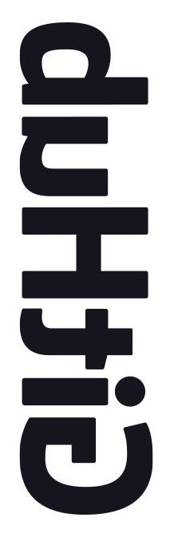

# Pre-process images for Deep Learning

Sometimes, we have not enough images for training in Deep Learning if we using ourself datasets.

I create this small program to process images for getting more training datasets.

After processing, you could get 8x images for training.

# Demo

## Origin Image:

## Generate Images:

    

   

## Usage
`python main.py -d=images_dir`

## Processing

1. rotate 90, 180, 270
2. flip
3. mirror

